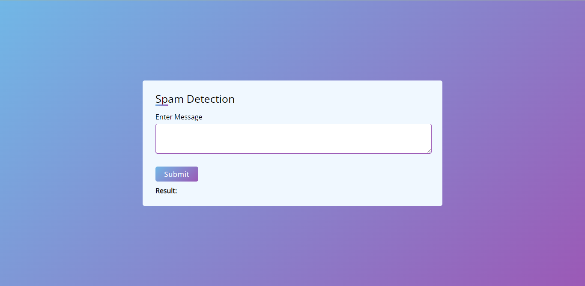

# Spam Classifier:

## Problem Statement:
* Our task is to predict whether a text or message is spam or not.
* Create end-to-end application that helps to detect whether a message is spam or not.
* Here I use Machine Learning algorithm to solve the problem.

## Approaches:
* **Step 01:**
  * Clean the data,
  * Analyze the data,
  * Apply text-preprocessing techniques,
  * Vectorize the data,
  * Save the data as preprocessed data.csv,
  
* **Step 02:**
  * Prepare the dataset for training,
  * Create a model using Machine Learning Algorithm (Multinomial Naive Bayes),
  * Apply text-preprocessing techniques on new text data,
  * Vectorize the data,
  * Start Prediction through **Web App**.

## How to execute:
* git clone https://github.com/dibyendubiswas1998/Spam-Classifier.git   
* pip install -r requirements.txt   
* python .\main.py  

## WebApp:

